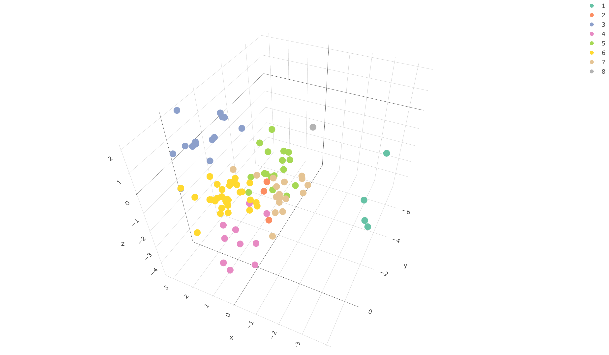

```{r setup, include=FALSE}
knitr::opts_chunk$set(echo = TRUE)
```

# 1 - kmeans

```{r, message=FALSE, warning=FALSE}
library(tibble)
library(ggpubr)
library(plotly)

load("films_clus.RData")
# km1 <- kmeans(films_clus, centers = 10, nstart = 100)

```

This command returns an error, since euclidean distance can be computed only on numerical data.

```{r, message=FALSE, warning=FALSE}
cbind(colnames(films_clus), 1:20)
data_num <- films_clus[, c(1, 5, 8, 9, 10, 11, 16)]
```

Of course we're losing a lot of information.

```{r, message=FALSE, warning=FALSE}
km1 <- kmeans(data_num, centers = 8, nstart = 100)
pairs(data_num[1:5], col = km1$cluster, pch = 20)

boxplot(data_num)
```

We have very different ranges $\implies$ let's scale the data:

```{r, message=FALSE, warning=FALSE}
# standardized data
scdata <- scale(data_num)
km2 <- kmeans(scdata, centers = 8, nstart = 100)
pairs(scdata[,1:5], col = km2$cluster, pch = 20)

pc <- princomp(data_num)
summary(pc)
s_pc <- princomp(scdata)
summary(s_pc)
```

The first two principal components are not enough informative.  
Let's evaluate the results on the first two anyways:

```{r, message=FALSE, warning=FALSE}
tbb <- tibble(
  "Dim.1" = pc$scores[, 1],
  "Dim.2" = pc$scores[, 2],
  "s_Dim.1" = s_pc$scores[, 1],
  "s_Dim.2" = s_pc$scores[, 2],
  "groups" = as.factor(km1$cluster),
  "s_groups" = as.factor(km2$cluster)
)

ggscatter(tbb,
          x = "Dim.1", y = "Dim.2",
          label = NULL,
          color = "groups",
          palette = "aaas",
          xlim= c(-750, 300),
          size = 0.8,
          ellipse = TRUE,
          ellipse.type = "convex",
          main = "Unscaled data",
          subtitle = "Problem: too much different ranges"
)
ggscatter(tbb,
          x = "s_Dim.1", y = "s_Dim.2",
          label = NULL,
          color = "s_groups",
          palette = "jco",
          ylim = c(-3.5, 1.5),
          size = 0.8,
          ellipse = TRUE,
          ellipse.type = "convex",
          main = "Scaled data",
          subtitle = "Problem: first two princomp not enough informative"
)
```

And now let's plot the clustering on the first three principal components:

```{r, eval=F}
plot_ly(
  x = s_pc$scores[, 1],
  y = s_pc$scores[, 2],
  z = s_pc$scores[, 3],
  type = "scatter3d",
  mode = "markers",
  color = as.factor(km2$cluster)
)
```
```{r, out.width="1\\linewidth", include=TRUE, fig.align="center", echo=FALSE}

```

*Note that the previous plot is interactive in a html file, so you can move the axes and inspect the points as you want.*
